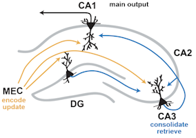
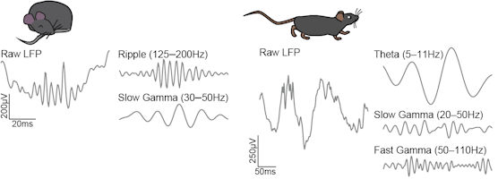
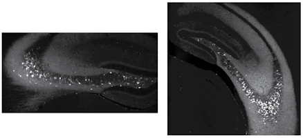



## Dynamics of Hippocampal Inputs in Learning and Disease

We rely on spatial memory daily, from remembering your favorite coffee shop location to learning a new hiking trail. To do so, our brains must encode representations of new information (e.g. the location of a coffee shop), adapt to incorporate new information as we learn, and consolidate old information for future retrieval. Studying the underlying physiology of spatial memory provides insights into how a single circuit can be plastic yet stable enough to consistently perform such varied, complex functions. Moreover, impaired spatial memory is one of the first symptoms of Alzheimer’s disease, thus understanding its underlying circuit mechanism is critical for developing treatments. Spatial memory is commonly studied in CA1, the major output region of the hippocampus. CA1 encodes and updates new information, driven by inputs from medial entorhinal cortex (MEC), and retrieves and consolidates old information, driven by inputs from hippocampal area CA3. Inputs from CA3 and MEC could interfere with each other if they arrive at overlapping times, impairing memory, and must be precisely gated to prevent this. However, the dynamics and mechanisms of this gating are unknown, as are the mechanisms by which Alzheimer's risk genes might lead to insufficient gating and thus memory interference.

**Our research seeks to answer three questions:**

	**(1) How can the hippocampal circuit perform these distinct computations?**
	
	**(2) How is the separation of these computations disrupted by neurodegeneration?**
	
	**(3) What are the molecular and cellular mechanisms of neurodegeneration that impair this separation?**
	
Our research dissects how the gating of inputs to the hippocampus adapts over learning and is altered in aging and Alzheimer's disease, affecting flexibility and stability of spatial representations and therefore memory, with the goal of identifying novel therapies for neurodegeneration.

## Techniques
|        |         |
| ------ | ------- |
| automated mazes to assess spatial memory | in vivo freely moving electrophysiology using custom-designed [chronic Neuropixels implants](/resources/) |
|  |   |
| recording simultaneously from multiple regions to interrogate the hippocampal-entorhinal circuit  | spatial representations by single cells    |
|  |     |
| measurements of how inputs to the hippocampus change over time, context, and memory task    | unbiased methods to assess how populations of neurons perform these computations    |
|  |         |
|        |         |

 * [novel models of late-onset Alzheimer's disease](https://www.model-ad.org/)

 * closed-loop optogenetic manipulations to control input gating at appropriate times

 * ex vivo and in vivo manipulations of identified druggable targets