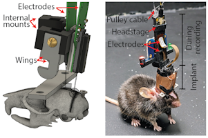



## Chronic Neuropixels in Mice

Protocols to chronically, recoverably implant single Neuropixels 1.0 probes or dual independent Neuropixels 2.0 probes into mice and record during a freely moving automated (non)match to direction task. Check out [Open Neuroscience](https://open-neuroscience.com/post/chronic_recoverable_neuropixels_in_mice/) for a detailed description.

**Protocols**
* [Full collection](https://dx.doi.org/10.17504/protocols.io.e6nvwjo87lmk/v2)
* [Assembly](https://dx.doi.org/10.17504/protocols.io.eq2lynnewvx9/v7)
* [Implant surgery](https://dx.doi.org/10.17504/protocols.io.yxmvmnn2bg3p/v6)
* [Explant surgery](https://dx.doi.org/10.17504/protocols.io.bp2l6113dvqe/v4)
* [Building a SpikeGLX rig with camera](https://dx.doi.org/10.17504/protocols.io.kxygxzzxkv8j/v3)
* [Building the maze and integrating with freely moving recording](https://dx.doi.org/10.17504/protocols.io.n92ldzz2ov5b/v6)

**Scripts and Build Files**
* [Chronic implant](https://github.com/emilyasterjones/chronic_NPX_mouse)
* [Task maze and video acquisition](https://github.com/emilyasterjones/X_maze)

**Parts Lists**
* [Neuropixels acquisition system](https://github.com/emilyasterjones/X_maze/blob/main/Build/Neuropixels%20Acquisition%20System%20Parts.xlsx)
* [Machine vision camera](https://github.com/emilyasterjones/X_maze/blob/main/Build/Mako%20G%20Camera%20Design.xlsx)
* [Freely moving apparatus and tracks](https://github.com/emilyasterjones/X_maze/blob/main/Build/Freely%20Moving%20Recording%20Rig%20Build.xlsx)

## DEI
[Two tools](https://github.com/emilyasterjones/bioRxiv_speaker_finder) to assist with some of my own [diversity & inclusion goals](/dei/)
1. Speaker finder: given a list of keywords, searches bioRxiv & Pubmed and returns the authors with the most publications that match that keyword
2. Citation overrepresentation tool: given a bibliography, returns which labs, institutions, & journals you cite the most

## Mentorship
* [How to write grad school application essays](https://coggle.it/diagram/YXiKIlKX7gsyTnlK/t/phd-admissions-essays/91463e537d0a24e2f26635b6bef59b8a0a538acde0b7f42ea337005fe05f9c21)
* [How to interview for grad school](https://coggle.it/diagram/YZVlv-lLLh-ZGbm_/t/phd-admission-interviews/43666a3279191c6b9c2156dce0bb383a83a4d3dbae0a04bb503f4df1c9e40713)
* [Advice to new grad students](../files/Advice to New Grad Students.pdf)
* [An outline to structure mentorship of a summer intern](https://docs.google.com/document/d/1vI6Y2CYhnJibP26MSLGcpTp8DGWNLv-sC5pXvsJZOfI/edit?usp=sharing)

## Teaching
* [Workshop to introduce biology grad students to coding](https://github.com/emilyasterjones/BMS-coding-bootcamp)
* [How to dissect research papers](https://github.com/emilyasterjones/how-to-read-a-paper)